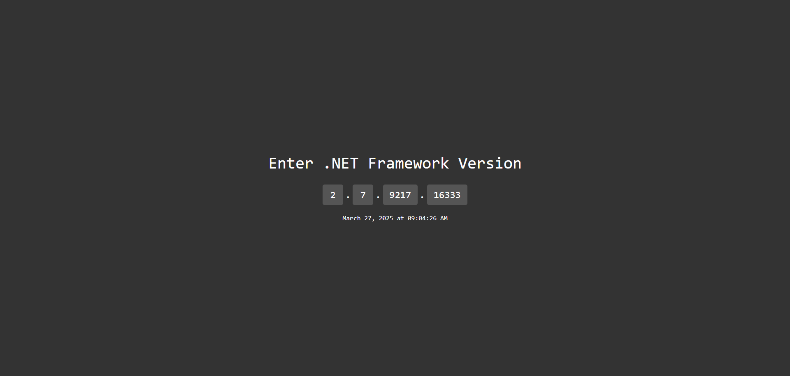

# .NET Framework Build Number Converter

Calculates the date & time of a .NET Framework Build given the Build-Number.

.NET Framework Build-Numbers are automatically created by the framework on each build.

